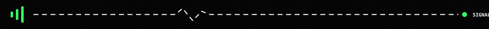

<!--
  PROFILE README // XEROX HACKER EDITION
  Palette: ink black / dirty white / phosphor green
-->

<div align="center">
  

# MATHIAS VIDELA

`BACK-END DEVELOPER // JAVA + SPRING BOOT`

[](https://github.com/Mathiasvidela)
[](https://www.google.com/maps/place/C%C3%B3rdoba,+Argentina)
[](https://www.mathiasvidela.dev)


</div>

```text
┌──[ mathias@localhost ]──[ ~/identity ]
└─$ whoami --verbose

 USER       Mathias Videla
 ROLE       Software Development Student
 BASE       Córdoba, Argentina
 SIGNAL     Java / Spring Boot / REST APIs
 OBJECTIVE  Build useful systems. Keep the code clean.
```

## `// WHOAMI`

I’m a software development student from Argentina focused on the machinery behind digital products: **APIs, data models, business rules and maintainable architectures**.

I’m building my path into back-end engineering through real projects—breaking systems down, tracing the problem and shipping a cleaner version.

```java
Developer mathias = Developer.builder()
    .focus("Back-end development")
    .core("Java", "Spring Boot", "REST APIs")
    .database("MySQL")
    .protocol("Learn → Build → Refactor → Repeat")
    .build();
```



## `// TOOLCHAIN`

<div align="center">


</div>

## `// ACTIVE OPERATIONS`

```diff
+ Design REST APIs with clear contracts
+ Apply layered architecture and separation of concerns
+ Persist data with Spring Data JPA + MySQL
+ Practice authentication and user management
+ Turn portfolio projects into production-ready software
! Keep everything readable, testable and maintainable
```

<details>
<summary><b>[ OPEN DEVELOPMENT LOG ]</b></summary>
<br />

- API validation and meaningful error handling
- Database modeling and persistence strategies
- Authentication, authorization and application security
- Deployment workflows and reliable developer tooling
- Front-end fundamentals to understand the full product surface

</details>

## `// FIELD REPORT`

<div align="center">
  
  
</div>

<div align="center">
  
</div>

## `// ESTABLISH CONTACT`

<div align="center">

**Have an idea, an opportunity or a strange bug worth chasing?**

[](https://www.mathiasvidela.dev)
[](mailto:mathiasvidela20@gmail.com)
[](https://github.com/Mathiasvidela)

```text
END OF TRANSMISSION_ █
```

</div>
