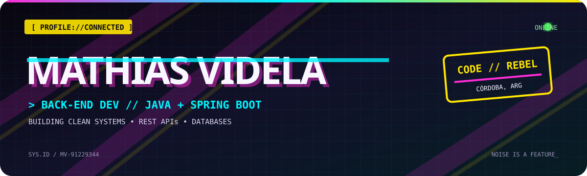
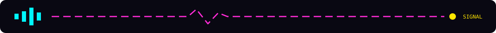

<!--
  PROFILE README // TECHNO STREET ART EDITION
  Palette: #FF2BD6 / #00F6FF / #FFE600 / #090812
-->

<div align="center">
  
</div>

<div align="center">

[](https://github.com/Mathiasvidela)
[](https://www.google.com/maps/place/C%C3%B3rdoba,+Argentina)
[](#-tech-arsenal)


</div>

```text
┌─[ mathias@dev-machine ]─[ ~/identity ]
└──╼ $ whoami --verbose

  NAME      Mathias Videla                 MODE      builder
  ROLE      Software Development Student   SPECIALTY Java / Spring Boot
  BASE      Córdoba, Argentina              STATUS    learning in public
  MISSION   Build useful, clean and scalable software.
```

## `// ACCESS GRANTED: ABOUT_ME`

I’m a software development student from Argentina building my path into **back-end engineering**. I like the invisible machinery behind a product: the APIs, data models, business rules and clean architectures that make everything click.

Right now I’m sharpening my Java + Spring Boot skills through real projects—breaking things, tracing the signal and shipping a cleaner version.

```java
Developer mathias = new Developer.Builder()
    .focus("Back-end development")
    .core("Java", "Spring Boot", "REST APIs")
    .database("MySQL")
    .mindset("Learn → Build → Refactor → Repeat")
    .build();
```



## `// TECH ARSENAL`

<div align="center">

### `CORE_PROTOCOLS`


### `FIELD_TOOLS`


</div>

## `// CURRENT MISSIONS`

```diff
+ Build REST APIs with clear contracts
+ Apply layered architecture and separation of concerns
+ Connect persistent data with Spring Data JPA + MySQL
+ Practice authentication and user management
+ Turn portfolio projects into production-ready software
! Keep the code readable, testable and maintainable
```

<details>
<summary><b>▸ OPEN DEV LOG / what I’m exploring</b></summary>
<br />

- API design, validation and meaningful error handling
- Database modeling and persistence strategies
- Authentication, authorization and application security
- Deployment workflows and reliable developer tooling
- Front-end fundamentals to understand the whole product surface

</details>

## `// LIVE TELEMETRY`

<div align="center">
  
  
</div>

<div align="center">
  
</div>

## `// OPEN CHANNEL`

<div align="center">

**Got an idea, an opportunity or a weird bug worth chasing? Let’s connect.**

[](https://www.mathiasvidela.dev)
[](mailto:mathiasvidela20@gmail.com)
[](https://github.com/Mathiasvidela)

```text
TRANSMISSION COMPLETE // SEE YOU IN THE NEXT COMMIT_
```

<sub>Designed with caffeine, curiosity and controlled chaos.</sub>

</div>
